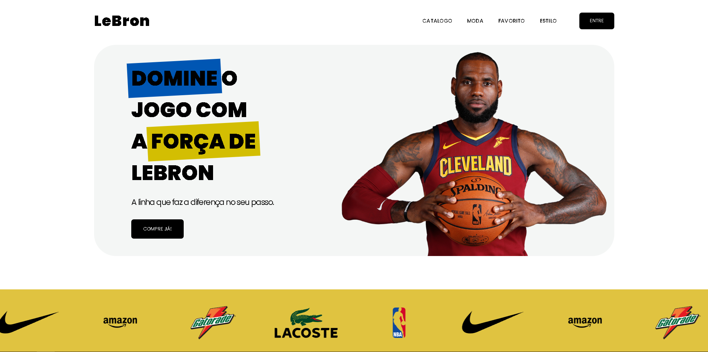

# 👟 Loja de Sapatos - Landing Page

<p align="center">
  
</p>

<p align="center">


</p>

---

# 📖 Sobre o Projeto

Este projeto foi desenvolvido por mim com o objetivo de colocar em prática os conhecimentos adquiridos durante o curso da Codeboost. O site possui um layout totalmente responsivo, utiliza Flexbox para a estruturação dos elementos e conta com animações que tornam a navegação mais dinâmica. Como proposta, foi criada uma página de apresentação para uma nova linha de tênis inspirada no jogador LeBron James.


---

# ✨ Funcionalidades

- ✅ Layout 100% responsivo
- ✅ Carrossel infinito de marcas
- ✅ Botões com animações
- ✅ Hover Effects

---

## 🛠 Tecnologias Utilizadas

<p align="center">


</p>

---

## 📂 Estrutura do Projeto

```text
📦 Projeto - Loja LeBron
 ┣ 📂 css
 ┣ 📂 imgs
 ┣ 📂 js
 ┣ 📜 index.html
 ┗ 📜 README.md
```

---

# 🌐 Deploy

Você pode acessar o projeto através do link:

🔗 **https://seu-projeto.vercel.app**

---

# 📚 Aprendizados

Durante este projeto pude reforçar conhecimentos importantes como:

- Estruturação semântica utilizando HTML5;
- Utilização de Flexbox;
- Desenvolvimento totalmente responsivo;
- Criação de componentes reutilizáveis;
- Aplicação de animações e efeitos de hover;
- Organização do projeto seguindo boas práticas.

---

## 📬 Contato

<div> 
   <a href="mailto:gabrielbarcelosarj@gmail.com">

</a>
  <a href="https://www.linkedin.com/in/gabrielbarcelosofc/" target="_blank"></a>   
  <a href="https://github.com/GabrielBarcelosD">

</a>
</div>


---

<p align="center">

Desenvolvido por **Gabriel Barcelos**

</p>